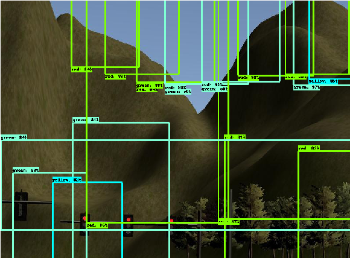
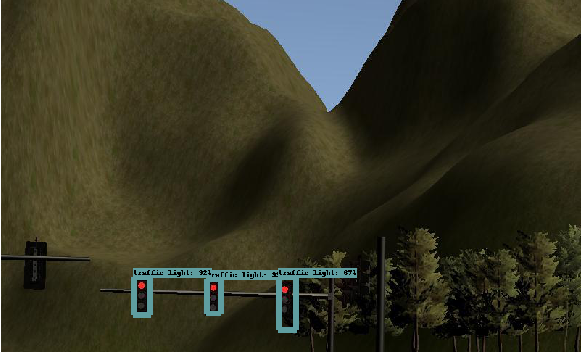
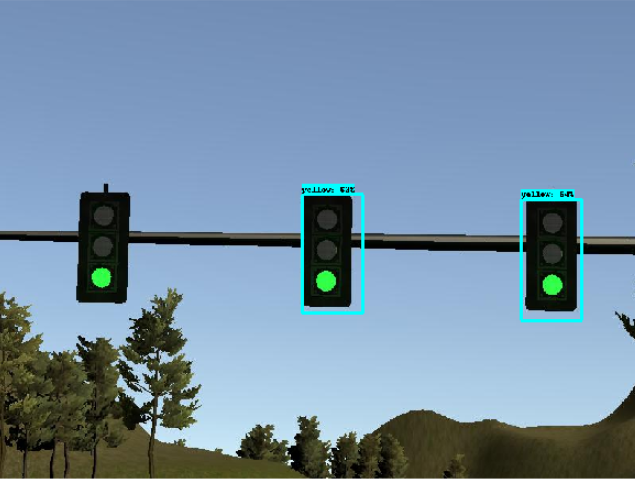
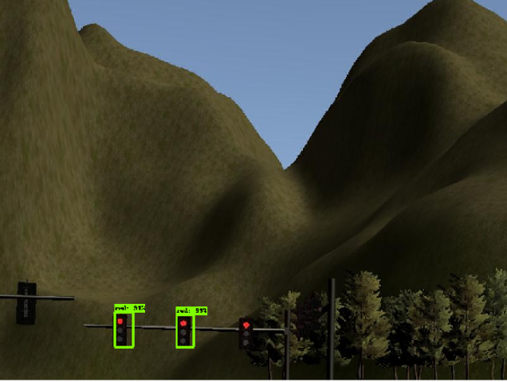
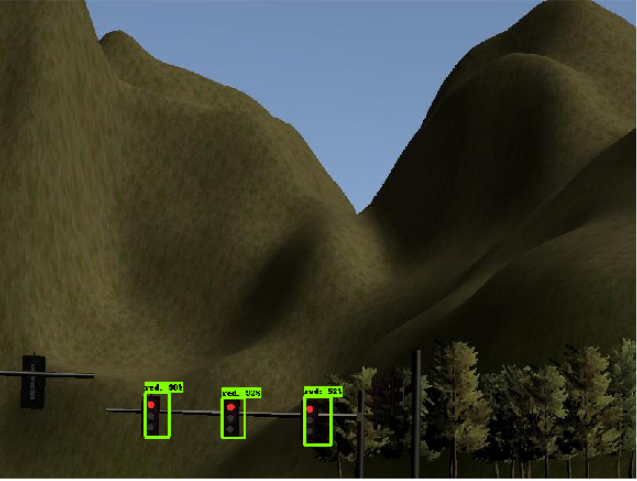
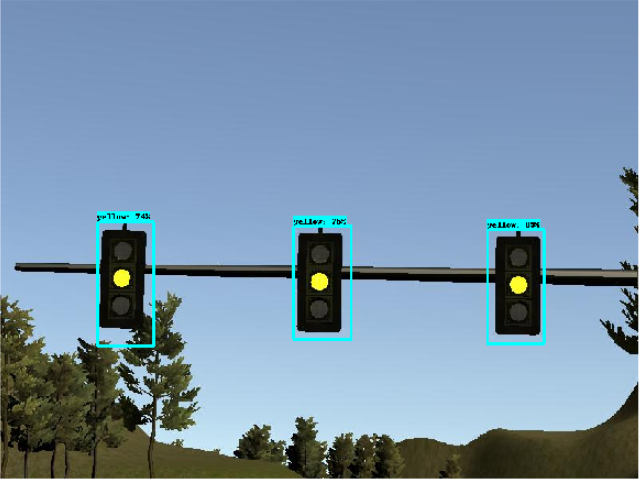

# self-driving-car-System-Integration
- [Udacity CarND System Integration Starter Repo](https://github.com/udacity/CarND-Capstone).


[//]: # (Image References)
[architecture]: ./assets/sdc_architecture.png
[waypoint_updater_1]: ./assets/waypoint_updater_1.png
[dbw]: ./assets/dbw.png
[tl_detection1]: ./assets/tl_detection1.png
[waypoint_updater_2]: ./assets/waypoint_updater_2.png
[tl_detection2]: ./assets/tl_detection2.png


![alt text][architecture]

# PART1: ROS Setup

## Step1: Waypoint Updater Node (partial)
![alt text][waypoint_updater_1]
- waypoint_updater.py
- subscribe the topics: 
- ```/base_waypoints```: all waypoints following the highway in the simulator. We can understand it as a Global map in the real world. As soon as the car follows these waypoints, it won’t go off the road. 
- ```/current_pose```: the car’s current position. 
- then publish on the topic: ```/final_waypoints ``` , publish a fixed number of waypoints ahead of the vehicle with the correct target velocities, depending on traffic lights and obstacles.


_**Notes for coding:**_
- either subscribe or publish topic need to know the exact message type we are dealing with. Otherwise, the error may thrown. For instance, to see what message does ```/current_pose``` has do following in the ROS: ```rostopic type /current_pose```. Grab the msg type and do ``` rosmsg show  geometry_msgs/PoseStamped```. Following info is expected to be shown. 
    ```
    ry_msgs/PoseStamped
    std_msgs/Header header
      uint32 seq
      time stamp
      string frame_id
    geometry_msgs/Pose pose
      geometry_msgs/Point position
        float64 x
        float64 y
        float64 z
      geometry_msgs/Quaternion orientation
        float64 x
        float64 y
        float64 z
        float64 w
    ```
- if the error is thrown: ```ERROR: Cannot load message class for [styx_msgs/Lane]. Are your messages built?```. The problem is probably that  ```source devel/setup.sh``` is did not executed. I had experienced this problem many times in the beginning. 
- to check what has published use ``` rostopic echo /final_waypoints```.
- another option to check if msg are published successfully to the topic: /final_waypoints. If the msg is published successfully, We should see the green waypoints ahead of the car. In the beginning, there was latency. The waypoints are not able to update on time. I removed the roslog.info. It helped a lot.


## Step2: DBW Node
![alt text][dbw]
- In this step, I want to accomplish that the car can follow the green waypoints ahead ignoring the traffic light and obstacles.
In order to let the car move, we need to provide [throttle,brake,steer] to the car. Each one of them is a topic. What we need to do is, publish the corresponding message on to the topic. For example, to provide [throttle] value to the car we need to publish the value, 0.2 (has to be within [0,1]), on the topic [/vehicle/throttle_cmd]. Let’s add following code into the dbw_node.py:
```self.publish(throttle=0.2,brake=0,steer=0)```. We can see the car is start moving now. Great.

- We want the car to be able to switch between automatic and manual driving mode. The topic [/vehicle/dbw_enabled] publish this info. We need to subscribe this topic and decide if we want the car to drive automatically or manually. To check the msg on the topic [/vehicle/dbw_enabled] we can do ``` rostopic echo /vehicle/dbw_enabled```.  We will see ```data: True``` or ```data: False``` by clicking checkbox,manual, on and off in the simulator.

- We need to use the car’s current velocity, waypoint linear velocity and waypoint angular velocity to control the car. The PID controller is adapted in this project. We need to feed Cur_vel, linear_vel, angular_vel to PID and corresponding [throttle,brake,steer] values are generated. I used ```rospy.loginfo``` to print out Cur_vel, linear_vel, angular_vel by subscribing the topics, ```/current_velocity``` and ```/twist_cmd ```.  The printing should look something like below: 
  ```
  [rosout][INFO] 2018-03-30 12:21:53,930: MYPRINTING-----Current Vel: 23.737354608-----
  [rosout][INFO] 2018-03-30 12:21:53,946: MYPRINTING-----Linear, Angular Vel:-6.6062637705,-0.756857457362-----
  [rosout][INFO] 2018-03-30 12:21:53,949: MYPRINTING-----Current Vel: 23.7981386368-----
  [rosout][INFO] 2018-03-30 12:21:53,976: MYPRINTING-----Current Vel: 23.9191925984-----
  [rosout][INFO] 2018-03-30 12:21:53,979: MYPRINTING-----Linear, Angular Vel:-5.18794387709,-0.963772954846-----
  [rosout][INFO] 2018-03-30 12:21:53,987: MYPRINTING-----Current Vel: 23.9191925984-----
  ```
- LowPassFilter:  this technique is adapted in the Controller in order to filter out noise from current velocity, like high frequency velocity.

- one significant problem I encountered was that the green waypoint suppose to be stay in front of the car falls behind the car. I assumed this problem is caused by calculation inefficiency.  In the node, update_waypoints, to calculate the closest waypoint index I implemented a loop that goes through 1000+ waypoints. I need to improve the efficiency of this calculation.  We can change the data structure of the base_waypoints. I adapted KDTree. Finding the closest waypoint index from the DKTree data is much efficient. After implementation, the lookahead waypoints latency issue is solved.

- At the end of this step, we should see:
  - the car is moving in a decent speed.
  - the car is following green waypoints ahead of it.
  - the green waypoints ahead of car are not falling behind anymore.


## Step3: Traffic Light Detection
![alt text][tl_detection1]
- subscribe ``` /vehicle/traffic_lights``` to get the state of lights which are RED, GREEN, YELLOW and UNKNOWN. The corresponding stop line for each traffic light is provided in ``` self.config['stop_line_positions']```.
- loop through each traffic light. If it is RED light, publish the index of waypoint nearest to the traffic light stop line on the topic ```/traffic_waypoint ```. If it is Not RED light, just publish ```-1``` on the ```/traffic_waypoint ```.

_**Note:**_ instead of pulling the state associate with simulator light data, I should implement traffic light classifier model. Detect the traffic light and its state from the topic ```/image_color ```.  Determine if it is RED or Not RED using the model. I will do this in next.

- ```rospy.logwarn()``` is another great tool in ROS for debugging the code. However, remember to turn it off if the code turn out to be correct. These logging did cause latency problem because they consumes computing resources. 
- check the camera option in the simulator on. Otherwise the  callback function [image_cb] won’t run.
- after re-launch the code, use ```rostopic echo /traffic_waypoint``` to check the msg published on the topic. The msg should be look like: ```data: -1``` or ```data: 292```.  The closest waypoint index near the traffic light stop line is shown if the light is RED. Otherwise, it should be shown -1.
- Test after adding above code. Unfortunately, the car won’t stop even it is RED light. Let’s fix it.


## Step4: STOP if it is RED light
![alt text][waypoint_updater_2]
- subscribe the topic ``` /traffic_waypoint``` and determine if it is the red traffic light.
- make sure the car can smoothly slowed to full stop at the traffic light. The smooth means acceleration should not exceed 10 m/s^2 and jerk should not exceed 10 m/s^3 according to what we learned from Path Planning project.
- what we need to do is decelerate waypoint velocities before publishing waypoints to ``` /final_waypoints ```. Updating the value of  ```Twist.pose.position.linear.x``` should slow down the car.


- from the beginning, i decided to use LOOKAHEAD_WPS = 30 because it helps with latency issue.  However, this value seems make the car decelerate in too short time. If I improve it to 200, the latency problem came up again. The green waypoints falls behind of the car, which has caused the car not able to drive along with waypoints. How do I fix this?  
  - I tried LOOKAHEAD_WPS = 30, 70, 100, 200. In the end I decide to use 100. It gives enough space to let the car slow down when it is RED light. And it solves the problem of waypoints falling behind the car.
  - I tried different ROS frequency, ```rospy.rate(Val) where Val=10,30,50,70```.  Using 70 make the problem worth because it requires more frequent calculation. Well 10 did work well, but it is just too slow. What if something happens within this period of time and we want the car to reactive on time. I adapted 30 in the end. Only because my computer can deal with this value well. 


_**Notes:**_
- Adding any function before ```rospy.spin()``` won’t execute. Because it only runs callback function repeatedly.
- No need to ```catkin_make``` when developing node with python. All we need to do after updating the code is ```roslaunch``` again. 
- python coding: define a function with parameter be careful with the parameter orders. I encountered this issue when calling the control function. The parameters are in mismatched order. 
- python coding: defining many variables are cumbersome. You may end up do not know where is the bug. Make sure variables defined with proper name and consistent. 
- why waypoints_cb run only at once?

# PART2: Model Training
- Instead of pulling the state associate with simulator light data, I need to implement traffic light classifier model. Detect the traffic light and its state from the topic ```/image_color ``` and PREDICT if it is RED or Not RED using the model. 

![alt text][tl_detection2]

### Setup TF Object Detection API ###
``` git clone https://github.com/tensorflow/models.git ```

Follow the [installation guide](https://github.com/tensorflow/models/blob/master/research/object_detection/g3doc/installation.md ) and make sure ```python object_detection/builders/model_builder_test.py ``` works in the end.

### Selecting a model ###
To select a proper model, following criteria are considered:
- The first thing in my mind is it has to be fast. Obviously, we do not want our car to wondering around to wait for the result if it is RED light or not.
- I do not have enough time to collect and pre-process data training the model. So I need to adapt Transfer Learning. 

To meet the above request, I decided to use SSD (Single Shot Detection) model.
**SSD** does following two things in one shot:
- Train a Region Proposal Network (RPN) which decides which regions of the image are worth drawing a box around.
- RPN is then merged with a pretrained model for classification. The classifier only works in the region.

- There are two SSD options in the [Tensorflow detection model zoo](https://github.com/tensorflow/models/blob/master/research/object_detection/g3doc/detection_model_zoo.md ).  We can USE these pretrained models by following code:
```
# Frozen inference graph files. NOTE: change the path to where you saved the models.
SSD1= 'ssd_mobilenet_v1_coco_2017_11_17/frozen_inference_graph.pb'
SSD2 = 'ssd_inception_v2_coco_2017_11_17/frozen_inference_graph.pb'
```

- Training SSD model is cumbersome process. We have to provide following two info in each training data (image). In this process a lot of manual hand work is involved. 
    - 4 corner bounding box locations (cx, cy, w, h).
    - C class probabilities (1, 0). 1:RED, 0:Not RED.

- Feature map is used to predict bounding boxes. 


### Preprocessing the data ###
#### Gather data ####
I have used the data from @olegleyz. This has saved me a lot of time just collecting data. Thanks @olegleyz. Following datasets are used to train the model:
- Simulator images
- Real site images from rosbag
- Bosch Small Traffic Lights Dataset.

#### Label and annotate the images ####
To train SSD model, we need to manually process each image data providing the bounding box and classification info.  [LabelImg](https://github.com/tzutalin/labelImg ) is a great free tool to annotate the images. This tool will generate annotation files in same format as [Pascal VOC](http://host.robots.ox.ac.uk/pascal/VOC/ ) dataset. 

I have training dataset:
```

```

#### Generate TFRecords file ####
In order to fine tune the SSD model, we have to feed the model with TFRecord training data. The reason we are putting image and annotation in one huge binary file is that it is efficient to read. It is time-consuming to read image and annotation file separately (check out this blog if you interested in detail). 

In this step, we need to convert  PascalVOC files into TFRecord file. I prepared a python code ```create_labelimg_tf_record.py``` based on the [create_pascal_tf_record.py](https://github.com/tensorflow/models/blob/master/research/object_detection/dataset_tools/create_pascal_tf_record.py ) provided in the TF Model repo. 

Need to create a label map file, ``` sim_label_map.pbtxt ```containing following info:
```
item {
  id: 1
  name: 'red'
}
item {
  id: 2
  name: 'yellow'
}
item {
  id: 3
  name: 'green'
}
```

Let’s run:
```
python create_labelimg_tf_record.py \
        --data_dir=./  \
        --img_dir=sim \
        --annotations_dir=label \
        --output_path=pascal2.record \
        --label_map_path=sim_label_map2.pbtxt

```

If above code gives an NOT FOUND type error, make sure following code is executed in the TF Models/research folder:
 ``` export PYTHONPATH=$PYTHONPATH:`pwd`:`pwd`/slim```

We will train the model in the next step.

### Training the model ###
Create new Folder ```mymodels```.
Copy the config file under [object_detection/samples/configs](https://github.com/tensorflow/models/tree/master/research/object_detection/samples/configs)  into this folder.
Create new folder named ```data``` and move the TF Record file and label_map file into this folder.
Create another folder named ```models``` and move the downloaded model folder 3 ckpt files into here.

Open the config file:
- Change the number of classes = 3
- change following: ```fine_tune_checkpoint: "models/model.ckpt"```
- num_steps: ``` 20 ```
- input_path: ``` data/pascal.record  ```.
- label_map_path: ``` data/sim_label_map.pbtxt ```.

Train the model:
```
python train.py --logtostderr --train_dir=./models/train1 
    --pipeline_config_path=ssd_mobilenet_v1_coco.config
```

### Saving the model ###
Saving a checkpoint model (.ckpt) as a .pb file.
- copy the ```export_inference_graph.py``` file into the folder containing your model config file.
- run following command to generate the model named frozen_inference_graph.pb in a new directory fine_tuned_model:
```
python export_inference_graph.py --input_type image_tensor 
    --pipeline_config_path ./ssd_mobilenet_v1_coco.config 
    --trained_checkpoint_prefix ./models/train1/model.ckpt-68 
    --output_directory ./fine_tuned_model1
```

### Testing the model ###
The result is terrible (see below), of course:



If I use original Mobilinet model to predict the same test image, I will get following nice predictions:



Obviously something is wrong. But this is a good start. In next, I need try following things: - Need to check my TF Records file.  I am wondering if something is wrong on the conversion from PASCAL xml file to TF records file. 
- Need to check the TF Object Detection API config file. 

### Optimization Loop ###
I tried following work:
- Understand the TF records file. Compare the tf record file size with the original images. Make sure the step of generating record file is correct.
- Understand the TF Object Detection API config file. Make sure my config file for fine tuning the model is correct.
- Added another case: classifying only Red and NotRed. 
- Ran the training again in my Linux machine (4G RAM). It finished after a little while. I am not expecting it to finish in short time. Something is wrong. Probably I don’t have enough memory. Let’s move to AWS next.

**Training on AWS**  

It did work on AWS. I got following training results for the case with 3 classes (red,green,yellow):

```
INFO:tensorflow:global step 83: loss = 3.7748 (11.255 sec/step)
INFO:tensorflow:global step 83: loss = 3.7748 (11.255 sec/step)
INFO:tensorflow:global step 84: loss = 3.4207 (8.379 sec/step)
INFO:tensorflow:global step 84: loss = 3.4207 (8.379 sec/step)
INFO:tensorflow:global step 85: loss = 2.6950 (8.345 sec/step)
INFO:tensorflow:global step 85: loss = 2.6950 (8.345 sec/step)
INFO:tensorflow:global step 86: loss = 3.5934 (8.439 sec/step)
INFO:tensorflow:global step 86: loss = 3.5934 (8.439 sec/step)
INFO:tensorflow:global step 87: loss = 3.4470 (8.369 sec/step)
INFO:tensorflow:global step 87: loss = 3.4470 (8.369 sec/step)
```

I got following training results for the case with 2 classes (red,notred):

```
INFO:tensorflow:global step 91: loss = 2.5754 (8.383 sec/step)
INFO:tensorflow:global step 91: loss = 2.5754 (8.383 sec/step)
INFO:tensorflow:global step 92: loss = 2.6952 (8.381 sec/step)
INFO:tensorflow:global step 92: loss = 2.6952 (8.381 sec/step)
INFO:tensorflow:global step 93: loss = 3.3248 (8.385 sec/step)
INFO:tensorflow:global step 93: loss = 3.3248 (8.385 sec/step)
INFO:tensorflow:global step 94: loss = 2.8824 (8.384 sec/step)
INFO:tensorflow:global step 94: loss = 2.8824 (8.384 sec/step)
INFO:tensorflow:global step 95: loss = 3.4559 (8.421 sec/step)
INFO:tensorflow:global step 95: loss = 3.4559 (8.421 sec/step)
```

**Export and test the results**

Test results for the case with 3 classes (red,green,yellow):
<p float="left">
    
    
    
    
</p>

Test results for the case with 2 classes (red,notred):

~~~~~~~~~~~~~~~~

Not bad. Let’s deploy it to the ROS and see if the car can drive well in the simulator.

### Deploying the model ###


## References ##
- [Tensorflow Models](https://github.com/tensorflow/models )
- [Udacity Object Detection Lab](https://github.com/udacity/CarND-Object-Detection-Lab )
- [Step by Step TensorFlow Object Detection API Tutorial — Part 1: Selecting a Model](https://medium.com/@WuStangDan/step-by-step-tensorflow-object-detection-api-tutorial-part-1-selecting-a-model-a02b6aabe39e)
- [Step by Step TensorFlow Object Detection API Tutorial — Part 2: Converting Existing Dataset to TFRecord](https://medium.com/@WuStangDan/step-by-step-tensorflow-object-detection-api-tutorial-part-2-converting-dataset-to-tfrecord-47f24be9248d)
- [Step by Step TensorFlow Object Detection API Tutorial — Part 3: Creating Your Own Dataset](https://medium.com/@WuStangDan/step-by-step-tensorflow-object-detection-api-tutorial-part-3-creating-your-own-dataset-6369a4d30dfd) 
- [Step by Step TensorFlow Object Detection API Tutorial — Part 4: Training the Model](https://medium.com/@WuStangDan/step-by-step-tensorflow-object-detection-api-tutorial-part-4-training-the-model-68a9e5d5a333)
- [Step by Step TensorFlow Object Detection API Tutorial — Part 5: Saving and Deploying a Model](https://medium.com/@WuStangDan/step-by-step-tensorflow-object-detection-api-tutorial-part-5-saving-and-deploying-a-model-8d51f56dbcf1)
- [Pascal VOC](http://host.robots.ox.ac.uk/pascal/VOC/ )
- [TFRecords guide](http://warmspringwinds.github.io/tensorflow/tf-slim/2016/12/21/tfrecords-guide/ )
- [TensorFlow Object Detection API in 5 clicks from Colaboratory](https://medium.com/@nickbortolotti/tensorflow-object-detection-api-in-5-clicks-from-colaboratory-843b19a1edf1)
- [How to train your own Object Detector with TensorFlow’s Object Detector API ](https://towardsdatascience.com/how-to-train-your-own-object-detector-with-tensorflows-object-detector-api-bec72ecfe1d9 )
- [Self Driving Vehicles: Traffic Light Detection and Classification with TensorFlow Object Detection API](https://becominghuman.ai/traffic-light-detection-tensorflow-api-c75fdbadac62)


## Next ##
- Use Udacity Driving dataset to train the model: https://github.com/udacity/self-driving-car/tree/master/annotations 
- Try classifying the entire image and see what is the result. Please refer to this repo: https://github.com/olegleyz/traffic-light-classification 
- Building a Toy Detector with Tensorflow Object Detection API
- How to play Quidditch using the TensorFlow Object Detection API

